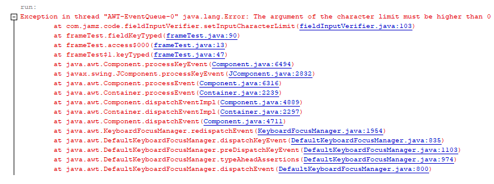

# FieldLimitator

Libreria de java que nos permite limitar la entrada del usuario, además de la posibilidad de que solo ingresen texto, números con y sin caracteres especiales.

Para esto podemos usar los primeros dos métodos incluidos en la clase **fieldInputVerifier**

El primer método llamado *setInputFilter*, recibe como parametros un entero además de un objeto de tipo evento **KeyEvent**.

Los parametros para esta función se encuentran en la misma clase y son los siguientes:

Argumento | valor del argumento (int)|Descripción del argumento|
----------|--------------------------|--------------------------
NO_CHARACTERS|0|Este argumento logra que la función solo permita la entrada de números. (incluidos caracteres especiales)|
NO_NUMBERS|1|Este argumento logra que la función solo permita la entrada de letras. (incluidos caracteres especiales)|
LETTERS_WO_SPECIAL_CHARACTERS|2|Este argumento cumple la misma función que **NO_CHARACTERS** pero sin la posibilidad de que el usuario ingrese caracteres especiales.|
NUMBERS_WO_SPECIAL_CHARACTERS|3|Este argumento cumple la misma función que **NO_NUMBERS** pero sin la posibilidad de que el usuario ingrese caracteres especiales.|

Estos argumentos se encuentran declarados como finales y son accesibles de forma estática por el programador.

El segundo método llamado *setInputCharacterLimit*, recibe como parametros Componente tipo **JTextField**, un entero que indica que cantidad de caracteres pueden ser introducidas
en el componente utilizado en la función, y por último un objeto de tipo evento **KeyEvent**

**Nota:** si la variable que contiene la cantidad de caracteres que se pueden introducir en el campo de texto es menor o igual a **0** la función retornara una excepción
diciendo que el argumento del limite de caracteres debe ser mayor que 0.

Excepción lanzada en consola:



## ¿Cómo uso la librería?

Empecemos por como puedo utilizar los métodos que se encuentran en la clase.

```sdsdsd
```
